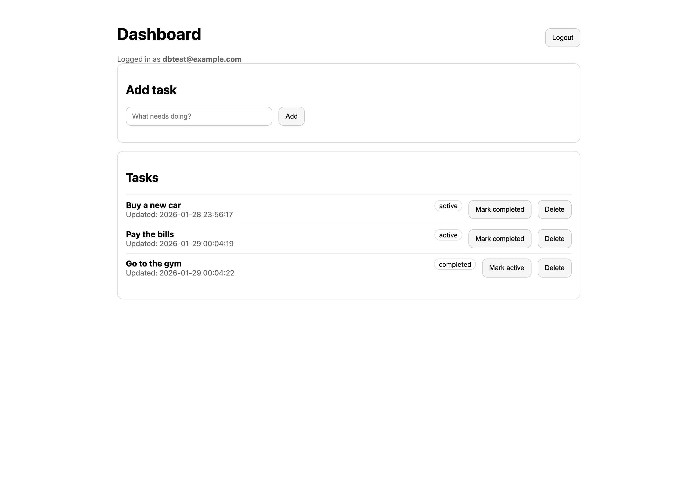
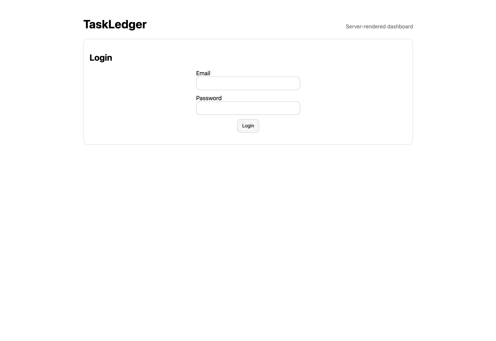

# TaskLedger
 
A fundamentals-first Node.js + Express application featuring session-based authentication, SQLite persistence, and a minimal server-rendered dashboard for task management.
 
This project intentionally prioritizes **backend and web fundamentals** over framework complexity.
 
---
 
## Features
 
- Email/password authentication (register, login, logout) using sessions and bcrypt
- Protected routes with session-based access control
- Task CRUD (create, list, update, delete)
- Task status management (`active`, `completed`, `archived`)
- Server-rendered dashboard using EJS
- Input validation and consistent error handling
- Lightweight `/health` endpoint for monitoring
- SQLite persistence with a simple relational schema
 
---

## Screenshots

Representative views highlighting semantic structure, responsive layout, and accessible UI patterns.

### Dashboard

### Login

All interactions shown are keyboard-accessible and progressively enhanced.

---
 
## Tech Stack
 
- **Node.js** 24.x (LTS)
- **Express**
- **EJS** (server-side rendering)
- **SQLite** (`better-sqlite3`)
- **Sessions**: `express-session` + `session-file-store`
- **Validation**: `zod`
- **Security / Ops**: `bcrypt`, `helmet`, `morgan`, `dotenv`
 
---
 
## Getting Started
 
### 1. Requirements
- Node.js 24.x
- npm (bundled with Node)
 
### 2. Install dependencies
    npm install
 
### 3. Configure environment variables
    cp .env.example .env
 
Edit `.env` and set:
 
    PORT=3000
    SESSION_SECRET=your_secret_here
    DB_PATH=.data/taskledger.db
 
### 4. Initialize the database
    npm run db:init
 
This creates the SQLite database and applies the schema.
 
### 5. Run the app
Development:
 
    npm run dev
 
Production:
 
    npm start
 
---
 
## Scripts
 
- `npm run dev` — run with nodemon
- `npm start` — start server
- `npm run db:init` — initialize database schema
 
---
 
## Routes
 
### API
 
- `GET /health`
- `POST /auth/register`
- `POST /auth/login`
- `POST /auth/logout`
- `GET /tasks`
- `POST /tasks`
- `PATCH /tasks/:id`
- `DELETE /tasks/:id`
 
### UI
 
- `GET /ui/login`
- `GET /ui/dashboard`
- `POST /ui/tasks`
- `POST /ui/tasks/:id/toggle`
- `POST /ui/tasks/:id/delete`
 
---
 
## Project Notes
 
- This project is designed to reflect real-world Express applications commonly found in existing production codebases.
- CommonJS modules are used intentionally for compatibility and simplicity.
- The UI is intentionally minimal and server-rendered to demonstrate classic request/response flows.
- Emphasis is placed on correctness, clarity, and maintainability over novelty.
- SQLite is used for persistence to keep the system self-contained and easy to inspect.

### Demo access

The live deployment includes a **demo login** option on the login screen.

- The demo account is created automatically on first use
- No credentials are exposed in the UI
- All data is persisted server-side using SQLite
- This allows visitors to explore the app without registering

This pattern is intentionally included to improve reviewability while keeping authentication mechanics explicit and controlled.
 
---

## Known Gotchas & Implementation Notes

This project intentionally uses file-based sessions and SQLite to reflect common real-world Express setups. As a result, there are a few important behaviors worth calling out:

### Session save timing

- When using `express-session` with `session-file-store`, session persistence is asynchronous.
- After successful login, the session must be explicitly saved before redirecting.
- Without calling `req.session.save(...)`, the browser may follow the redirect before the session file and cookie are fully written, resulting in a one-time `401 Unauthorized` on the first dashboard load.
- This is a common race condition in Express apps using file-based or async session stores.
 
### File-backed persistence

- User sessions and the SQLite database are stored under `.data/`.
- Deleting this directory resets all users, sessions, and tasks.
- This behavior is intentional for local development and demo clarity.

### Development vs production differences

- File-based session stores are convenient for demos but are not ideal for production.
- A production deployment would typically replace this with a centralized store (Redis, database-backed sessions, etc.) to avoid race conditions and scaling issues.

These behaviors are well-understood tradeoffs and are documented here to reflect real-world Express application concerns rather than abstracted or hidden behavior.

---

## License
 
MIT
